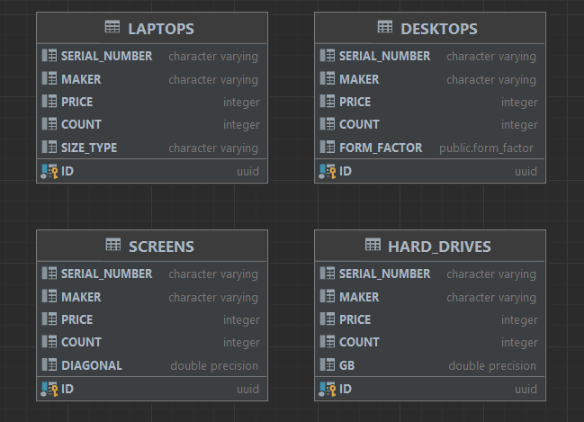

# Тестовое задание для EasyBot

### Описание
Приложение для магазина, торгующего компьютерами и комплектующими.
В [application.properties](src/main/resources/application.properties) указаны настройки, с которыми можно запустить приложение.
Класс [Product](src/main/java/easyBot/testTask/model/Product.java) описывает основные свойства всех товаров, хранящихся в БД. 
Его реализации:
* [Desktop](src/main/java/easyBot/testTask/model/Desktop.java) - настольный компьютер; обладает дополнительным свойством - форм-фактор (formFactor).
* [HardDrive](src/main/java/easyBot/testTask/model/HardDrive.java) - жесткий диск; обладает дополнительным свойством - объем (GB).
* [Laptop](src/main/java/easyBot/testTask/model/Laptop.java) - ноутбук; обладает дополнительным свойством - размер (sizeType).
* [Screen](src/main/java/easyBot/testTask/model/Screen.java) - монитор; обладает дополнительным свойством - диагональ (diagonal).

[Сигнатура методов](src/main/java/easyBot/testTask/controller/ProductController.java), поддерживаемых приложением:

    Optional<Product> addProduct(@RequestBody ProductInputDto productInputDto);

    Product updateProduct(@RequestBody ProductUpdateDto productUpdateDto);

    List<Product> getProductsByType(@PathVariable String type);

    Product getProductById(@RequestParam UUID id);
}
 

### Стек:
Java 11, Spring Boot, Maven, JUnit, Spring Data JPA, H2

### Эндпоинты:

##### Пример запроса: #####
* POST http://localhost:8080/products

 `{
  "type":"screen",
  "diagonal": 13.3,
  "serialNumber": "serialNumber",
  "maker": "maker",
  "price": 100,
  "count": 2
  }`
  ##### Пример ответа: #####
  `{
  "id": "4d905985-fb50-4c2b-847d-87512fe98ad0",
  "serialNumber": "serialNumber",
  "maker": "maker",
  "price": 100,
  "count": 2,
  "diagonal": 13.3
  }`
##### Пример запроса: #####
* PUT http://localhost:8080/products
 
  `{
  "id": "195dc268-7a8e-46eb-9c24-9aeab226f128",
  "type":"screen",
  "diagonal": 13.3,
  "serialNumber": "serialNumber",
  "maker": "maker",
  "price": 100,
  "count": 2
  }`
  ##### Пример ответа: #####
  `{
  "id": "4d905985-fb50-4c2b-847d-87512fe98ad0",
  "serialNumber": "serialNumber",
  "maker": "maker",
  "price": 100,
  "count": 2,
  "diagonal": 13.3
  }`
##### Пример запроса: #####
* GET http://localhost:8080/products/laptop
##### Пример ответа: #####
`[
{
"id": "4d905985-fb50-4c2b-847d-87512fe98ad0",
"serialNumber": "serialNumber",
"maker": "maker",
"price": 100,
"count": 2,
"diagonal": 13.3
}
]`

##### Пример запроса: #####
* GET http://localhost:8080/products?id=4d905985-fb50-4c2b-847d-87512fe98ad0
  ##### Пример ответа: #####
  `{
  "id": "4d905985-fb50-4c2b-847d-87512fe98ad0",
  "serialNumber": "serialNumber",
  "maker": "maker",
  "price": 100,
  "count": 2,
  "diagonal": 13.3
  }`

##### [Тесты](src/test/java/easyBot/testTask/service/ProductServiceTest.java) ####
